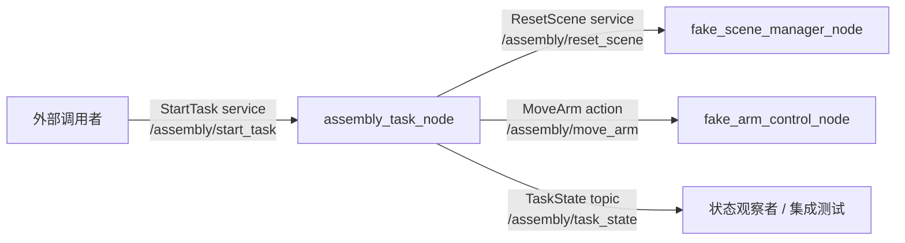

# Bimanual Dexterous Assembly MVP

双臂灵巧手协同装配研究工作空间。项目长期目标包含双臂、灵巧手和
Peg-in-Hole 装配，但当前 MVP 主线主动降维为单臂、夹爪化末端和
Pick-and-Place。MVP 阶段先验证 ROS 2 通信、任务编排、场景重置、机械臂
Action、状态发布和错误处理等基础链路；双臂协同、灵巧手全关节控制、
精密插入和柔顺控制放入 Post-MVP 研究路线。

> 当前阶段：MVP-0 已完成，等待通过 Git tag 固定冻结版本。
> MVP-0 的目标不是证明真实装配能力，而是建立一条可编译、可启动、可重复
> 执行、可测试、可失败定位的纯软件任务链路。
> 当前纯软件 fake 链路已通过干净环境回归。

## 项目目标

本项目的近期目标不是直接完成高精度装配，而是搭建一个可以反复运行、
可重置、可记录、可替换模块的单臂 Pick-and-Place 最小任务系统。
接口命名仍保留 `right_arm`、`right_hand`、`left_arm`、`left_hand`
这类扩展余量，但 MVP 完成不要求双臂协同或灵巧手精细操作。

MVP 阶段优先验证：

* ROS 2 package、service、action 和 topic 的基础接口可编译、可运行。
* 任务层能够按固定顺序调用场景、单机械臂和夹爪化末端模块。
* 灵巧手在 MVP 阶段先降维为夹爪或预设抓型执行器。
* Pick-and-Place 可以作为机器人任务系统的最小可展示闭环。
* 左右机械臂、灵巧手、控制器和命名空间后续可以独立扩展。
* 失败时能够返回错误码、日志和任务状态，而不是静默失败。
* 从干净环境重新构建后，系统能够通过一条启动命令和一组自动化测试复现。

Pick-and-Place 只能验证系统骨架，不能替代真正的精密装配能力。双臂协同、
灵巧手全关节控制、接触建模、柔顺控制、力反馈、孔轴对准、插入搜索、
卡阻检测和失败恢复会在 Post-MVP 阶段逐步加入。

## 硬件基线

真实硬件选型已经确定：

| 角色 | 型号 | 当前工程映射 |
| --- | --- | --- |
| 机械臂 | Franka Research 3 | `right_arm` 先映射到首个或右侧 FR3 |
| 灵巧手 | 因时 RH56DFTP-2R | `right_hand` 先映射到首个或右侧 RH56DFTP-2R |

MVP-0 仍然只运行纯软件 fake 系统，不加载真实硬件驱动，也不下发真实关节
命令。硬件基线用于后续 URDF / MoveIt / MuJoCo / ros2_control / 真机
bringup 的命名和集成规划。详细约定见
`doc/hardware/hardware_baseline.md`。

## MVP-0 阶段进度

| 阶段   | 内容                                                  | 状态      |
| ---- | --------------------------------------------------- | ------- |
| 阶段 1 | ROS 2 工程绿色基线与 Git 初始化                               | 已完成     |
| 阶段 2 | `TaskState`、`StartTask`、`ResetScene`、`MoveArm` 接口生成 | 已完成     |
| 阶段 3 | Fake Scene Manager 与 `/assembly/reset_scene`        | 已完成     |
| 阶段 4 | Fake Arm Control 与 `/assembly/move_arm`             | 已完成     |
| 阶段 5 | `assembly_task_node` 最小任务编排                         | 已完成     |
| 阶段 6 | 一键启动、集成测试与连续运行验证                                    | 已完成     |
| 收尾阶段 | 干净环境回归、文档冻结、版本标签与验收证据                               | 已完成     |

## MVP-0 最小纵向链路

MVP-0 的目标任务链路为：

```text
StartTask service
  -> assembly_task_node
  -> ResetScene service
  -> MoveArm action
  -> TaskState topic
  -> SUCCESS / FAILED
```

最小状态机为：

```text
IDLE -> RESETTING -> ARM_HOME -> SUCCESS
                     \-> FAILED
```

MVP-0 的简化系统架构如下：



当前 MVP-0 只支持固定任务：

* `task_name`: `mvp0_home`
* `arm_name`: `right_arm`，逻辑映射到首个或右侧 Franka Research 3
* `target_name`: `home`

## 仓库结构

```text
.
├── doc/
│   ├── hardware/            # 真实硬件选型和命名基线
│   └── mvp0/
│       ├── tasks/               # MVP-0 分阶段任务说明
│       └── acceptance/          # MVP-0 验收结果、接口快照和完成清单
├── src/
│   ├── assembly_interfaces/     # 自定义 msg/srv/action 接口
│   ├── assembly_task/           # 最小任务编排节点
│   ├── fake_scene_manager/      # Fake 场景管理服务
│   ├── fake_arm_control/        # Fake 机械臂 Action Server
│   ├── fake_hand_control/       # 灵巧手控制占位包
│   ├── fake_terminal_operation/ # 末端操作占位包
│   ├── assembly_bringup/        # 启动编排包
│   └── assembly_tests/          # 集成测试包
└── README.md
```

## 软件包说明

| Package                   | 说明                                      | MVP-0 状态 |
| ------------------------- | --------------------------------------- | -------- |
| `assembly_interfaces`     | 定义任务服务、状态消息和机械臂 Action                  | 已实现      |
| `assembly_task`           | 维护最小任务流程，调用场景和机械臂接口                     | 已实现      |
| `fake_scene_manager`      | 提供 `/assembly/reset_scene` 服务           | 已实现      |
| `fake_arm_control`        | 提供 `/assembly/move_arm` Action          | 已实现      |
| `fake_hand_control`       | 后续封装 `open/preshape/close/hold/release` | 占位       |
| `fake_terminal_operation` | 后续封装 `PLACE/INSERT` 末端任务                | 占位       |
| `assembly_bringup`        | 集中管理 MVP-0 一键启动 launch 文件               | 已完成      |
| `assembly_tests`          | 放置 MVP-0 集成验收测试                         | 已完成      |

## 环境要求

* Ubuntu 22.04
* ROS 2 Humble
* Python 3.10
* `colcon`

进入工作空间后，先加载 ROS 环境：

```bash
source /opt/ros/humble/setup.bash
```

## 构建

```bash
cd /home/ace/bimanual_dexterous_mvp_ws
source /opt/ros/humble/setup.bash
colcon build --symlink-install
source install/setup.bash
```

## 运行 MVP-0

在阶段 6 完成后，可通过一条命令启动 Fake 最小链路：

```bash
cd /home/ace/bimanual_dexterous_mvp_ws
source /opt/ros/humble/setup.bash
source install/setup.bash
ros2 launch assembly_bringup mvp0_fake_system.launch.py
```

该 launch 文件应同时启动：

```text
fake_scene_manager_node
fake_arm_control_node
assembly_task_node
```

另开一个终端发送任务请求：

```bash
cd /home/ace/bimanual_dexterous_mvp_ws
source /opt/ros/humble/setup.bash
source install/setup.bash

ros2 service call \
  /assembly/start_task \
  assembly_interfaces/srv/StartTask \
  "{task_name: 'mvp0_home'}"
```

如果命令一直停在：

```text
waiting for service to become available...
```

先确认另一个终端中的 launch 仍在运行，然后绕过 ROS 2 daemon 检查 DDS
发现结果：

```bash
ros2 daemon stop
ros2 node list --no-daemon --spin-time 5
ros2 service list --no-daemon --spin-time 5 | grep assembly
```

正常应能看到：

```text
/assembly_task_node
/fake_arm_control_node
/fake_scene_manager_node
/assembly/start_task
/assembly/reset_scene
```

如果 `--no-daemon` 能看到节点和 service，而普通 `ros2 service call` 仍然
等待，通常是 ROS 2 daemon 缓存或发现状态异常。保持 daemon 停止后重新调用
service，或重新打开终端并重新 source 环境。注意 `--no-daemon` 是
`node list` / `service list` 的参数，应放在子命令后面。

可选：检查接口。

```bash
ros2 service list | grep -E '/assembly/(start_task|reset_scene)'
ros2 action list | grep /assembly/move_arm
ros2 topic list | grep /assembly/task_state
```

可选：监听任务状态。

```bash
ros2 topic echo /assembly/task_state
```

一次合法任务应至少发布以下状态：

```text
RESETTING
ARM_HOME
SUCCESS
```

当 ResetScene 服务或 MoveArm Action 不可用、执行失败或超时时，应发布：

```text
FAILED
```

## ROS 接口

### Service

| 名称                      | 类型                                   | 说明         |
| ----------------------- | ------------------------------------ | ---------- |
| `/assembly/start_task`  | `assembly_interfaces/srv/StartTask`  | 请求启动一个任务   |
| `/assembly/reset_scene` | `assembly_interfaces/srv/ResetScene` | 重置 Fake 场景 |

### Action

| 名称                   | 类型                                   | 说明           |
| -------------------- | ------------------------------------ | ------------ |
| `/assembly/move_arm` | `assembly_interfaces/action/MoveArm` | 请求机械臂移动到命名目标 |

### Topic

| 名称                     | 类型                                  | 说明            |
| ---------------------- | ----------------------------------- | ------------- |
| `/assembly/task_state` | `assembly_interfaces/msg/TaskState` | 发布任务状态、进度和错误码 |

## StartTask 响应与任务结果约定

MVP-0 中，`StartTask` 的 `accepted` 字段只表示请求是否通过任务入口校验：

```text
accepted = false
```

表示：

```text
task_name 为空
或 task_name 不受支持
```

对于合法任务：

```text
accepted = true
task_id 非空
error_code = 0
message = "Task accepted"
```

任务最终是否成功，必须以 `/assembly/task_state` 的终态为准：

```text
SUCCESS：最小链路执行成功
FAILED：任务在 ResetScene 或 MoveArm 阶段失败
```

MVP-0 可以采用同步实现，但不得把 `accepted` 误解为“任务已成功完成”。

MVP-1 及后续阶段可将任务执行改为后台异步模型；此时 `accepted = true`
仍表示“任务已被受理”，最终结果继续由任务状态 Topic 或后续查询接口返回。

## MVP-0 完成关闭项

MVP-0 不再新增功能模块。以下项目全部完成并留存验收证据后，才能宣告
MVP-0 完成。

### 1. 完成并验收最小任务编排节点

`assembly_task_node` 必须实现：

```text
Service Server：/assembly/start_task
Service Client：/assembly/reset_scene
Action Client：/assembly/move_arm
Topic Publisher：/assembly/task_state
```

合法任务应执行：

```text
StartTask(mvp0_home)
-> RESETTING
-> ResetScene(task_id)
-> ARM_HOME
-> MoveArm(right_arm, home, 5.0)  # right_arm 映射到 Franka Research 3
-> SUCCESS
```

非法任务应返回明确错误：

```text
task_name = ""
-> accepted = false
-> error_code = 3001

task_name != "mvp0_home"
-> accepted = false
-> error_code = 3002
```

### 2. 保证任务执行模型不会死锁或永久阻塞

`assembly_task_node` 不得在单线程 ROS 回调中阻塞等待自身依赖的 Future，
导致服务、Action 或反馈无法推进。

MVP-0 至少采用以下其中一种实现方式：

```text
方案 A：
MultiThreadedExecutor
+ ReentrantCallbackGroup
+ 合理等待 ResetScene 与 MoveArm Future

方案 B：
StartTask 回调创建独立工作线程，
由工作线程执行 ResetScene 与 MoveArm，
主 ROS executor 保持可调度状态
```

验收要求：

```text
合法任务不会卡死
失败场景不会永久等待
Action Result 能正常返回
连续任务不会因回调阻塞导致节点失去响应
```

### 3. 完成一键启动文件

`assembly_bringup` 中必须提供：

```text
launch/mvp0_fake_system.launch.py
```

启动命令：

```bash
ros2 launch assembly_bringup mvp0_fake_system.launch.py
```

启动后必须可发现：

```text
/assembly/reset_scene
/assembly/start_task
/assembly/move_arm
/assembly/task_state
```

### 4. 完成自动化集成测试

`assembly_tests` 必须能够自动启动 MVP-0 Fake 系统，并至少覆盖：

```text
1. 合法 mvp0_home 请求
2. 空 task_name 请求
3. 不支持的 task_name 请求
4. RESETTING -> ARM_HOME -> SUCCESS 状态序列
5. 连续执行 10 次合法任务
6. task_id 递增且不重复
```

推荐测试命令：

```bash
cd /home/ace/bimanual_dexterous_mvp_ws
source /opt/ros/humble/setup.bash
colcon build --symlink-install
source install/setup.bash

colcon test \
  --packages-select assembly_tests \
  --event-handlers console_direct+

colcon test-result --verbose
```

### 5. 完成干净环境回归验证

不得依赖旧的 `build/`、`install/` 或 `log/` 目录残留。

每次准备冻结 MVP-0 前，都必须从干净环境完成一次回归：

```bash
cd /home/ace/bimanual_dexterous_mvp_ws

rm -rf build install log

source /opt/ros/humble/setup.bash

colcon build --symlink-install
source install/setup.bash

colcon test --event-handlers console_direct+
colcon test-result --verbose
```

验收要求：

```text
全部 8 个 package 可构建
接口生成无错误
launch 文件可正常启动
集成测试全部通过
不存在 Python import 错误
不存在依赖历史构建产物的情况
```

### 6. 冻结文档、错误码和验收证据

完成 MVP-0 前，应在仓库中保留以下资料：

```text
doc/mvp0/acceptance/
├── mvp0_completion_checklist.md
├── build_and_test_result.md
├── interface_snapshot.md
└── known_limitations.md
```

建议至少记录：

```text
Git commit hash
ROS 2 Humble 版本
Python 版本
构建命令
测试命令
测试结果
失败场景结果
当前已知限制
```

完成验收后，创建版本标签：

```bash
git status
git add README.md doc/mvp0/acceptance src
git commit -m "chore: freeze MVP-0 acceptance baseline"
git push

git tag -a mvp0.0.0 -m "MVP-0 fake system integration complete"
git push origin mvp0.0.0
```

## 错误码表

| 错误码    | 来源            | 含义                                     |
| ------ | ------------- | -------------------------------------- |
| `0`    | 通用            | 无错误                                    |
| `1001` | ResetScene    | `task_id` 不能为空                         |
| `2001` | MoveArm       | 不支持的 `arm_name`                        |
| `2002` | MoveArm       | 不支持的 `target_name`                     |
| `2003` | MoveArm       | `timeout_sec` 必须大于 0                   |
| `3001` | StartTask     | `task_name` 不能为空                       |
| `3002` | StartTask     | 不支持的 `task_name`                       |
| `3101` | Assembly Task | `/assembly/reset_scene` 服务不可用          |
| `3201` | Assembly Task | `/assembly/move_arm` Action Server 不可用 |

对于下层接口返回的业务错误，`assembly_task_node` 应尽量透传：

```text
error_code = 下层接口返回的 error_code
message = 下层接口返回的 message
```

## 集成验收测试

MVP-0 的自动化验收至少覆盖：

```text
合法任务请求
空 task_name
不支持的 task_name
任务状态发布
ResetScene 不可用
MoveArm 不可用
连续 10 次执行
task_id 连续递增
```

合法任务的期望状态序列：

```text
RESETTING -> ARM_HOME -> SUCCESS
```

失败任务的期望终态：

```text
FAILED
```

连续执行 10 次后，应满足：

```text
每次请求均可返回
每个 task_id 均不重复
每次任务均有终态
节点不崩溃
节点不死锁
日志可定位任务开始、状态变化和失败原因
```

## MVP-0 完成定义

MVP-0 完成不等于“Fake 节点代码已经写完”，而是满足以下所有条件：

```text
任何人从干净环境拉取仓库后：

1. 可以完成 colcon build；
2. 可以通过一条 launch 命令启动系统；
3. 可以通过 StartTask 发起 mvp0_home；
4. 可以观察到 RESETTING -> ARM_HOME -> SUCCESS；
5. 可以对非法请求获得明确错误码；
6. 保留 ResetScene 与 MoveArm 失败时发布 FAILED 的错误处理路径；
7. 可以通过自动化测试重复验证；
8. 可以连续执行 10 次而不崩溃、不死锁；
9. 可以从日志和 TaskState 定位失败位置；
10. 可以通过 Git tag 定位冻结版本。
```

在以上条件全部满足前，项目状态应标记为：

```text
MVP-0 收尾与验收中
```

全部满足后，项目状态可更新为：

```text
MVP-0 已完成：Fake 系统最小纵向链路已冻结
```

## 设计原则

* 上层任务接口保持通用，不把系统核心写死为单一 `place` 流程。
* 抓取、运输和末端操作分阶段设计，便于后续把 `PLACE` 替换为 `INSERT`。
* 灵巧手在 MVP 阶段被降维为夹爪或预设抓型执行器，任务层只发送高层命令。
* 双臂能力在 MVP 阶段只做接口和命名预留，不作为完成标准。
* 场景中的物体抓取可先使用逻辑附着，后续再替换为真实物理接触。
* 关键动作必须有超时、错误码和结构化日志。
* 任务成功与失败必须具有可观测终态，不能静默结束。
* 上层接口在 MVP-2 替换底层控制实现时应尽量保持稳定。
* 真实硬件基线为 Franka Research 3 + 因时 RH56DFTP-2R，但上层任务
  接口继续使用 `right_arm`、`right_hand` 这类逻辑名。

建议的长期任务分层：

```text
acquire object -> transport object -> terminal operation
```

其中 `terminal operation` 在 MVP 阶段保持为 Pick-and-Place，Post-MVP
阶段再升级为 Peg-in-Hole 或其他装配末端操作。

## MVP 路线图

这里的 MVP 指最小可验证产品，而不是长期研究目标的完整分解。MVP 主线始终
围绕单臂、夹爪化末端和 Pick-and-Place 展开；双臂协同、灵巧手全关节控制、
Peg-in-Hole 和柔顺控制进入 Post-MVP 研究路线。

每一阶段都应保留一键启动、可重复测试、状态发布、错误码和日志，不因为
替换底层能力而破坏上层任务接口。

| 阶段    | 版本目标                                         | 核心验收结果                         |
| ----- | -------------------------------------------- | ------------------------------ |
| MVP-0 | Fake 最小纵向链路                                  | `mvp0_home` 可启动、可观测、可测试、可冻结 |
| MVP-1 | Fake 单臂 + 夹爪化末端 Pick-and-Place 完整任务闭环        | 抓取、搬运、放置状态机跑通               |
| MVP-2 | RViz / MoveIt / MTC 单 FR3 Pick-and-Place     | FR3 由规划执行固定抓取和放置目标点         |
| MVP-3 | MuJoCo 或等价仿真的单 FR3 + 夹爪化 RH56 Pick-and-Place | 验证仿真关节控制、物体状态和场景重置          |

MVP-3 完成后，项目应已经具备一个可演示、可测试、可复现的单臂 Pick-and-Place
系统。后续是否进入双臂、灵巧手精细控制、Peg-in-Hole 或真机接触实验，应按
研究目标和硬件条件另行选择。

### MVP-1：Fake 单臂 Pick-and-Place 闭环

MVP-1 的目标是从 MVP-0 的 `RESETTING -> ARM_HOME -> SUCCESS` 扩展为一条
完整但仍然是 Fake 的单臂 Pick-and-Place 任务链路。`right_hand` 在本阶段
按夹爪或预设抓型执行器处理，不追求灵巧手全关节控制。

推荐状态机：

```text
IDLE
-> RESETTING
-> ARM_HOME
-> HAND_OPEN
-> ARM_PREGRASP
-> HAND_PRESHAPE
-> ARM_GRASP
-> HAND_CLOSE
-> ATTACH_OBJECT
-> ARM_LIFT
-> ARM_PREPLACE
-> ARM_PLACE
-> DETACH_OBJECT
-> HAND_OPEN
-> ARM_RETREAT
-> ARM_HOME
-> SUCCESS
```

本阶段应实现：

```text
fake_hand_control:
  open / preshape / close / hold / release

fake_scene_manager:
  reset_scene / attach_object / detach_object / get_object_pose

fake_terminal_operation:
  execute_terminal_operation(operation_type = PLACE)

fake_arm_control:
  home / pregrasp / grasp / lift / preplace / place / retreat

assembly_task:
  支持 task_name = "pick_and_place_mvp"
```

验收重点：

```text
1. 一条 launch 命令启动完整 Fake Pick-and-Place 系统；
2. 一条 StartTask 请求触发完整任务；
3. 物体可被逻辑附着和解除附着；
4. 每个关键动作都有 TaskState；
5. 任一 Fake 服务或 Action 失败时进入 FAILED；
6. 连续执行 10 次不崩溃、不死锁；
7. 集成测试覆盖成功链路和主要失败链路。
```

技术栈：

```text
ROS 2 Humble
rclpy
ROS 2 Service / Action / Topic
自定义 msg / srv / action
launch_ros
Python dataclass
YAML 配置
pytest / unittest
colcon
```

MVP-1 暂不引入：

```text
MoveIt 真实规划
MuJoCo 物理接触
双臂协同
灵巧手全关节真实控制
视觉定位
力控制
Peg-in-Hole 插入
真机控制
```

### MVP-2：RViz / MoveIt / MTC 单 FR3 Pick-and-Place

MVP-2 的目标是把 MVP-1 中 Fake 机械臂的底层能力替换为 MoveIt 或 MTC
规划执行，但尽量保持 `assembly_task` 的上层状态机和任务接口稳定。
本阶段仍然是单臂、夹爪化末端和固定 Pick-and-Place。

推荐演进路径：

```text
Fake MoveArm
-> MoveIt named target
-> MoveIt pose target
-> PlanningScene object
-> AttachedCollisionObject
-> 简单 Pick-and-Place 轨迹
```

验收重点：

```text
1. RViz 中可以看到 Franka Research 3 模型、TF 和规划场景；
2. 机械臂能规划并执行 home / pregrasp / grasp / place 等固定目标；
3. 物体能加入 PlanningScene；
4. 抓取后物体能作为 attached object 跟随末端；
5. 释放后物体从 attached object 回到场景；
6. 上层 StartTask 和 TaskState 语义不变。
```

技术栈：

```text
MoveIt 2
MoveIt Task Constructor 可选
RViz2
URDF / Xacro
SRDF
TF2
robot_state_publisher
joint_state_publisher 或 joint_state_broadcaster
ros2_control
joint_trajectory_controller
MoveIt PlanningScene
MoveIt collision object / attached collision object
```

### MVP-3：MuJoCo 单 FR3 + 夹爪化 RH56 物理仿真

MVP-3 的目标是把单臂 Pick-and-Place 放进物理仿真环境，验证关节控制、
场景重置、物体状态同步和基础接触参数。因时 RH56DFTP-2R 在本阶段仍然
按夹爪或预设抓型执行器建模，不要求多指精细操作。

验收重点：

```text
1. MuJoCo 中 Franka Research 3、因时 RH56DFTP-2R、桌面和物体模型可加载；
2. ROS 2 控制命令能驱动仿真关节；
3. 场景可以重置到确定初始状态；
4. 物体位置和附着状态可观测；
5. 任务结束后可以重复运行；
6. 物理仿真失败时能回传明确 FAILED 状态。
```

技术栈：

```text
MuJoCo
MJCF 或 URDF 到 MuJoCo 模型转换
ROS 2 与 MuJoCo bridge
ros2_control 仿真硬件接口
trajectory controller
/clock 仿真时间
接触参数、摩擦、质量和惯量配置
rosbag2 可选
```

## Post-MVP 研究路线

以下内容属于 MVP 之后的研究路线，不作为 MVP-3 完成条件。它们可以根据
课题重点、硬件可用性和时间预算择优推进。

### Post-MVP A：真机冒烟与安全支线

真机支线可以从 MVP-2 或 MVP-3 期间并行启动，但目标是提前暴露硬件接入
风险，不要求完整任务成功。

验收重点：

```text
1. 真机上电和驱动启动流程可重复；
2. 可以读取 joint_states；
3. TF、joint name、控制器命名与工程约定一致；
4. 控制器可以 enable / disable；
5. Franka Research 3 能低速回 Home 或移动到固定安全点；
6. 因时 RH56DFTP-2R 可以通信、使能和执行开合动作；
7. 急停、限速、关节限位和工作空间限制已经验证。
```

### Post-MVP B：低风险真机 Pick-and-Place

在 MVP-3 仿真链路稳定、真机冒烟支线通过后，可以尝试低风险真机
Pick-and-Place。

建议顺序：

```text
空载执行简化轨迹
-> 软物体或安全道具 Pick-and-Place
-> 固定抓取位姿的重复执行
-> 再考虑更接近装配的任务
```

### Post-MVP C：双臂系统扩展

双臂能力不作为 MVP 主线要求。进入该方向时，第一目标也不是高难度协同，
而是验证左右系统可以共存、独立控制、状态可区分。

验收重点：

```text
1. 左右臂、左右手有清晰 namespace；
2. 左右控制器不会互相抢资源；
3. TF 树没有重复 frame 或断裂；
4. 双臂碰撞模型可用；
5. 任务状态能区分 left/right 子任务；
6. 简单顺序任务可运行。
```

### Post-MVP D：灵巧手精细控制

MVP 阶段把 RH56 降维为夹爪或预设抓型执行器。Post-MVP 阶段再逐步考虑
多指关节控制、触觉闭环、滑移检测、抓型库和掌内操作。

### Post-MVP E：Peg-in-Hole 与柔顺控制

Peg-in-Hole、力/触觉反馈、admittance / impedance 控制、卡阻检测和
失败恢复属于接触型装配研究。建议先在仿真中做大间隙、低速、固定初始位姿
的简化插入，再过渡到真机接触实验。

验收重点：

```text
1. 插入对象和孔位在已知坐标系下定义；
2. 机械臂能低速沿插入轴直线运动；
3. 能判断插入成功、超时或失败；
4. 能记录插入深度、最终位姿和错误码；
5. 有急停、速度限制和工作空间限制；
6. 实验数据可记录、可回放、可复盘。
```

## 实施策略补充

### MVP 主线与研究支线

MVP 主线只解决一个问题：能否稳定搭出单臂、夹爪化末端、Pick-and-Place
任务系统。早期主线按以下顺序推进：

```text
MVP-1：Fake 单臂 Pick-and-Place
MVP-2：MoveIt / MTC 单臂 Pick-and-Place
MVP-3：MuJoCo 单臂 Pick-and-Place
```

这样做的目的不是放弃双臂、灵巧手或 Peg-in-Hole，而是先得到一个最短、
稳定、可测试、可演示的机器人任务闭环。

真机、双臂、灵巧手精细控制、Peg-in-Hole、柔顺控制和学习策略都属于
研究支线。它们可以在 MVP 主线稳定后按需要推进，其中真机冒烟测试可以
从 MVP-2 或 MVP-3 期间并行开始，但不作为 MVP 完成标准：

```text
真机上电
读取 joint_states
确认 TF 和 joint name
控制器 enable / disable
Franka Research 3 单关节或单臂低速回 Home
因时 RH56DFTP-2R 通信、使能和开合动作单独验证
急停、限位和速度限制验证
```

真机支线的目标是提前暴露硬件接入风险；MVP 主线的目标是保证任务架构
可解释、可重复、可测试、可演示。

### 复杂能力的引入节奏

项目最终目标包含双臂、灵巧手和接触型装配，但这些能力不应作为 MVP
完成标准。推荐分层引入：

```text
第一层：单臂 + 夹爪化末端 + Pick-and-Place
第二层：真机冒烟和低风险单臂 Pick-and-Place
第三层：双臂系统存在和顺序执行
第四层：灵巧手精细控制
第五层：Peg-in-Hole、接触感知和柔顺控制
```

双臂方向的第一步不是高难度协同，而是验证：

```text
左右 namespace
双臂 URDF / Xacro
TF frame 命名
MoveIt planning group
controller 配置
joint_states 是否冲突
launch 参数化
任务层是否能区分 left / right
```

真正的双臂协同装配、灵巧手精细操作和 Peg-in-Hole 应建立在以上工程基础
稳定之后。

### 学习模型的使用边界

模仿学习、强化学习或抓取生成模型可以作为后续能力，但不应成为早期 MVP
成功的前置条件。早期应先建立不用模型也能跑通的可解释基线：

```text
object pose from config
pregrasp pose from config
grasp pose from config
hand preshape from grasp_library.yaml
close hand
logical attach / simulated attach
```

学习模型更适合作为模块替换，而不是直接控制完整任务。推荐系统分层为：

```text
assembly_task 状态机
  -> arm_motion 规划模块
  -> hand_control 抓型模块
  -> scene_manager 场景模块
  -> terminal_operation 末端操作模块
       -> optional learning_policy
```

后续适合引入模型的位置：

```text
抓取位姿生成：
  输入物体点云、RGB-D、mesh 或 object pose；
  输出 grasp pose、grasp type、approach direction 和 score。

灵巧手抓型或闭合策略：
  输入物体形状、手指状态、触觉或接触信息；
  输出 preshape、finger joint targets、closure amount 或 grip force。

插入和装配修正策略：
  输入末端位姿误差、力/力矩、触觉和接触状态；
  输出小幅修正动作、搜索方向、插入速度或撤退判断。
```

不建议早期让模型直接从 reset 到任务结束输出整段 Pick-and-Place 或
Peg-in-Hole 动作。这样会把规划、抓取、控制、接触和失败恢复混在一起，
难以定位问题。

推荐引入节奏：

```text
MVP-1：不用模型，全 Fake；
MVP-2：不用模型，FR3 MoveIt / MTC 固定抓取；
MVP-3：不用模型，FR3 + 夹爪化 RH56 物理仿真和控制接口验证；
Post-MVP：可选接入简单 grasp pose generator；
Post-MVP：Peg-in-Hole 或灵巧手方向再考虑插入修正和抓型策略；
Post-MVP：模仿学习或强化学习作为策略模块正式比较。
```

## 非目标

MVP-0 不包含以下内容：

* 任意物体抓取或自动抓取姿态生成。
* 视觉定位、触觉闭环、滑移检测和掌内操作。
* 真实 MoveIt/MTC 规划、MuJoCo 接触仿真或 ros2_control 控制器。
* 力控制、阻抗控制、插入搜索、卡阻检测和自动失败恢复。
* 真机控制、真机双臂协同或真实装配执行。
* 强化学习或端到端策略。
* 任务队列、任务取消、暂停恢复和多任务并发。

## 参考文档

* `doc/mvp0/tasks/`：MVP-0 的分阶段任务说明。
* `doc/hardware/hardware_baseline.md`：Franka Research 3 与因时
  RH56DFTP-2R 的硬件选型和命名基线。
* `doc/mvp0/acceptance/`：MVP-0 构建、测试和冻结验收记录。
* `双臂灵巧手_MVP_Pick_and_Place占位方案.txt`：Pick-and-Place 作为
  Peg-in-Hole 占位任务的原始方案说明。
