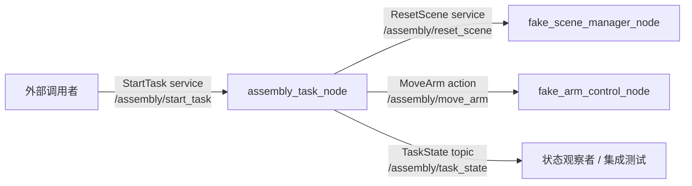

# MVP-0 总体任务说明：ROS 2 最小纵向链路

## 0. 文档索引

MVP-0 按以下分点文档推进和冻结：

```text
00_MVP0_总体任务说明.md
01_MVP0_工程绿色基线总结.md
02_MVP0_首批最小接口任务说明.md
03_MVP0_Fake场景管理器任务说明.md
04_MVP0_Fake机械臂控制器任务说明.md
05_MVP0_最小任务编排节点任务说明.md
06_MVP0_一键启动与集成验收任务说明.md
```

MVP-0 的冻结验收材料保存在：

```text
doc/mvp0/acceptance/
├── mvp0_completion_checklist.md
├── build_and_test_result.md
├── interface_snapshot.md
└── known_limitations.md
```

## 1. 工作目标

MVP-0 的目标不是完成真实装配，也不是实现 Pick-and-Place，而是建立一条
可编译、可启动、可重复执行、可测试、可失败定位的纯软件 ROS 2 最小任务链路。

本阶段要证明的是：

```text
一条 StartTask 请求
-> 任务编排节点受理
-> Fake 场景重置
-> Fake 机械臂回到 home
-> 任务状态可观测
-> 成功或失败有明确终态
```

MVP-0 只验证 ROS 2 package、service、action、topic、launch、错误码、日志和
集成测试能形成一个稳定闭环。

## 2. 本阶段范围

MVP-0 实现以下最小能力：

```text
assembly_interfaces:
  定义 TaskState、StartTask、ResetScene、MoveArm

fake_scene_manager:
  提供 /assembly/reset_scene

fake_arm_control:
  提供 /assembly/move_arm，仅支持 right_arm -> home

assembly_task:
  提供 /assembly/start_task，编排 mvp0_home 最小状态机

assembly_bringup:
  提供 mvp0_fake_system.launch.py

assembly_tests:
  提供 MVP-0 集成验收测试
```

涉及目录：

```text
doc/mvp0/tasks/
doc/mvp0/acceptance/
src/assembly_interfaces/
src/fake_scene_manager/
src/fake_arm_control/
src/assembly_task/
src/assembly_bringup/
src/assembly_tests/
```

## 3. 非目标

MVP-0 不实现：

```text
真实 Franka Research 3 控制
真实因时 RH56DFX-2R 控制
灵巧手开合或预设抓型
真实 Pick-and-Place
MoveIt / MTC 真实规划
MuJoCo 或其他物理仿真
视觉定位
力控制或触觉闭环
真实接触和摩擦
航空插头插接
双臂协同
任务取消、暂停、恢复
多任务并发
自动失败恢复
学习模型或抓取生成模型
```

MVP-0 中的 `right_arm` 只是逻辑名，由 fake action server 处理。`right_hand`
只做硬件基线和命名预留，本阶段不控制灵巧手。

## 4. 固定任务定义

MVP-0 只支持一个固定任务：

```text
task_name = "mvp0_home"
arm_name = "right_arm"
target_name = "home"
timeout_sec = 5.0
```

硬件逻辑映射：

```text
right_arm  -> 首个或右侧 Franka Research 3
right_hand -> 首个或右侧因时 RH56DFX-2R，仅做命名预留
```

## 5. 最小状态机

成功路径：

```text
IDLE
-> RESETTING
-> ARM_HOME
-> SUCCESS
```

失败路径：

```text
RESETTING 失败 -> FAILED
ARM_HOME 失败  -> FAILED
```

每个关键状态都应发布 `TaskState`，并带上：

```text
task_id
current_state
previous_state
progress
error_code
message
```

## 6. 最小纵向链路

MVP-0 的目标链路为：

```text
StartTask service
  -> assembly_task_node
  -> ResetScene service
  -> MoveArm action
  -> TaskState topic
  -> SUCCESS / FAILED
```

简化系统架构：



## 7. 接口规划

### 7.1 StartTask

服务名：

```text
/assembly/start_task
```

接口：

```text
string task_name
---
bool accepted
string task_id
int32 error_code
string message
```

MVP-0 中，`accepted` 只表示请求是否通过任务入口校验，不代表任务已经完成。
任务最终结果必须以 `/assembly/task_state` 的终态为准。

### 7.2 ResetScene

服务名：

```text
/assembly/reset_scene
```

接口：

```text
string task_id
---
bool success
int32 error_code
string message
```

### 7.3 MoveArm

Action 名：

```text
/assembly/move_arm
```

接口：

```text
string arm_name
string target_name
float32 timeout_sec
---
bool success
int32 error_code
string message
---
string current_state
float32 progress
```

MVP-0 只支持：

```text
arm_name = "right_arm"
target_name = "home"
timeout_sec > 0.0
```

### 7.4 TaskState

Topic 名：

```text
/assembly/task_state
```

接口：

```text
string task_id
string current_state
string previous_state
float32 progress
int32 error_code
string message
```

## 8. 错误码约定

| 错误码 | 来源 | 含义 |
| --- | --- | --- |
| `0` | 通用 | 无错误 |
| `1001` | ResetScene | `task_id` 不能为空 |
| `2001` | MoveArm | 不支持的 `arm_name` |
| `2002` | MoveArm | 不支持的 `target_name` |
| `2003` | MoveArm | `timeout_sec` 必须大于 0 |
| `3001` | StartTask | `task_name` 不能为空 |
| `3002` | StartTask | 不支持的 `task_name` |
| `3101` | AssemblyTask | `/assembly/reset_scene` 服务不可用 |
| `3201` | AssemblyTask | `/assembly/move_arm` Action Server 不可用 |

对于下层接口返回的业务错误，`assembly_task_node` 应尽量透传：

```text
error_code = 下层接口返回的 error_code
message = 下层接口返回的 message
```

## 9. 运行方式

构建工作空间：

```bash
cd /home/ace/bimanual_dexterous_mvp_ws
source /opt/ros/humble/setup.bash
colcon build --symlink-install
source install/setup.bash
```

启动 MVP-0 fake 系统：

```bash
ros2 launch assembly_bringup mvp0_fake_system.launch.py
```

该 launch 文件应同时启动：

```text
fake_scene_manager_node
fake_arm_control_node
assembly_task_node
```

另开终端发送任务请求：

```bash
cd /home/ace/bimanual_dexterous_mvp_ws
source /opt/ros/humble/setup.bash
source install/setup.bash

ros2 service call \
  /assembly/start_task \
  assembly_interfaces/srv/StartTask \
  "{task_name: 'mvp0_home'}"
```

可选：监听任务状态。

```bash
ros2 topic echo /assembly/task_state
```

一次合法任务应至少发布：

```text
RESETTING
ARM_HOME
SUCCESS
```

## 10. ROS 2 发现排查

如果 `ros2 service call` 一直停在：

```text
waiting for service to become available...
```

先确认 launch 仍在运行，然后绕过 ROS 2 daemon 检查 DDS 发现结果：

```bash
ros2 daemon stop
ros2 node list --no-daemon --spin-time 5
ros2 service list --no-daemon --spin-time 5 | grep assembly
```

正常应能看到：

```text
/assembly_task_node
/fake_arm_control_node
/fake_scene_manager_node
/assembly/start_task
/assembly/reset_scene
```

如果 `--no-daemon` 能看到节点和 service，而普通 `ros2 service call` 仍然
等待，通常是 ROS 2 daemon 缓存或发现状态异常。保持 daemon 停止后重新调用
service，或重新打开终端并重新 source 环境。

注意：`--no-daemon` 是 `node list` / `service list` 的参数，应放在子命令后面。

## 11. 验收范围

MVP-0 集成测试覆盖：

```text
合法任务请求
空 task_name
不支持的 task_name
RESETTING -> ARM_HOME -> SUCCESS
连续 10 次执行
task_id 不重复且递增
```

未启动 ResetScene 或 MoveArm 时进入 `FAILED` 的专项失败注入测试已降级为
后续增强验收项；任务层仍保留对应错误处理路径。

冻结前执行过一次干净环境回归：

```text
rm -rf build install log
colcon build --symlink-install
colcon test --event-handlers console_direct+
colcon test-result --verbose
```

最终汇总：

```text
30 tests, 0 errors, 0 failures, 8 skipped
```

冻结版本标签：

```text
mvp0.0.0
```

## 12. 阶段状态

| 阶段 | 内容 | 状态 |
| --- | --- | --- |
| 阶段 1 | ROS 2 工程绿色基线与 Git 初始化 | 已完成 |
| 阶段 2 | `TaskState`、`StartTask`、`ResetScene`、`MoveArm` 接口生成 | 已完成 |
| 阶段 3 | Fake Scene Manager 与 `/assembly/reset_scene` | 已完成 |
| 阶段 4 | Fake Arm Control 与 `/assembly/move_arm` | 已完成 |
| 阶段 5 | `assembly_task_node` 最小任务编排 | 已完成 |
| 阶段 6 | 一键启动、集成测试与连续运行验证 | 已完成 |
| 收尾阶段 | 干净环境回归、文档冻结、版本标签与验收证据 | 已完成 |

## 13. 后续衔接

MVP-1 在 MVP-0 已冻结的 fake 纵向链路基础上，扩展为 fake 单臂
Pick-and-Place 闭环。MVP-1 可以复用以下基础能力：

```text
StartTask 任务入口
TaskState 状态发布
ResetScene 场景重置
MoveArm action 形态
assembly_bringup 一键启动方式
assembly_tests 集成验收方式
错误码和失败终态约定
```

MVP-1 的详细任务拆解见：

```text
doc/mvp1/tasks/00_MVP1_总体任务说明.md
```
