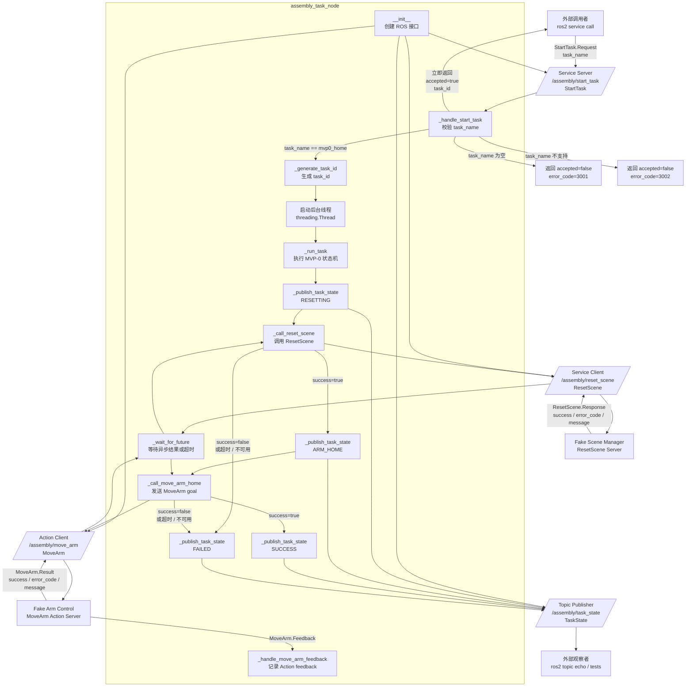

# MVP-0 第五阶段工作说明：最小任务编排节点

## 1. 工作目标

在 `assembly_task` 软件包中实现第一个最小任务编排节点：

```text
assembly_task_node
```

该节点接收启动任务请求，按固定顺序调用前面阶段已经完成的 Fake Server：

```text
ResetScene Service Server
MoveArm Action Server
```

本阶段完成后，项目将第一次形成完整的 MVP-0 最小纵向链路：

```text
StartTask
→ ResetScene
→ MoveArm(right_arm, home)
→ SUCCESS
```

## 2. 本阶段范围

实现：

```text
节点：assembly_task_node
Service Server：/assembly/start_task
Service Client：/assembly/reset_scene
Action Client：/assembly/move_arm
Topic Publisher：/assembly/task_state
```

使用接口：

```text
assembly_interfaces/srv/StartTask
assembly_interfaces/srv/ResetScene
assembly_interfaces/action/MoveArm
assembly_interfaces/msg/TaskState
```

本阶段只支持一个固定任务：

```text
task_name = "mvp0_home"
```

硬件映射说明：

```text
right_arm = 首个或右侧 Franka Research 3 的逻辑名
right_hand = 因时 RH56DFTP-2R 的逻辑名，本阶段不控制灵巧手
```

本阶段仍然只调用 fake server，不加载真实硬件驱动，也不发送真实关节命令。

暂不实现：

```text
完整 Pick and Place
因时 RH56DFTP-2R 灵巧手动作
末端操作
双臂协同
任务队列
任务取消
任务暂停和恢复
多任务并发
复杂错误恢复
MoveIt
MuJoCo
Franka Research 3 真实机械臂控制
```

## 3. 最小状态机

本阶段只实现以下状态：

```text
IDLE
→ RESETTING
→ ARM_HOME
→ SUCCESS
```

失败时进入：

```text
FAILED
```

各状态含义：

```text
IDLE：节点已启动，等待 StartTask 请求
RESETTING：正在调用 /assembly/reset_scene
ARM_HOME：正在调用 /assembly/move_arm，让 right_arm 回到 home；
right_arm 在硬件基线中映射到 Franka Research 3
SUCCESS：最小任务链路执行成功
FAILED：最小任务链路执行失败
```

## 3.1 assembly_task_node 数据流图

本图用于理解 `assembly_task_node` 内部的主要调用关系。它不是 ROS 2 底层
协议图，而是从任务编排角度描述请求、状态发布、服务调用和 Action 调用
如何串联起来。



## 4. StartTask 服务规则

请求包含：

```text
task_name
```

处理流程：

```text
接收 StartTask 请求
→ 检查 task_name
→ 生成 task_id
→ 返回 accepted = true
→ 发布 RESETTING 状态
→ 调用 ResetScene
→ 发布 ARM_HOME 状态
→ 调用 MoveArm(right_arm, home)
→ 发布 SUCCESS 状态
```

当 `task_name` 为空时，建议返回：

```text
accepted = false
task_id = ""
error_code = 3001
message = "task_name must not be empty"
```

当 `task_name` 不是 `mvp0_home` 时，建议返回：

```text
accepted = false
task_id = ""
error_code = 3002
message = "unsupported task_name"
```

合法请求的响应：

```text
accepted = true
task_id = 自动生成的任务编号
error_code = 0
message = "Task accepted"
```

本阶段建议 `StartTask` 服务先在同一个回调中同步执行最小链路。

后续阶段再改成真正的后台任务执行模型。

## 5. task_id 生成规则

本阶段不需要引入 UUID 依赖，建议使用简单递增编号：

```text
mvp0_task_0001
mvp0_task_0002
mvp0_task_0003
```

节点内部维护：

```text
task_counter
current_task_id
current_state
previous_state
```

每次合法 `StartTask` 请求到来时，`task_counter` 加 1，并生成新的 `task_id`。

## 6. TaskState 发布规则

每次状态变化时发布一条：

```text
/assembly/task_state
```

消息类型：

```text
assembly_interfaces/msg/TaskState
```

字段填写规则：

```text
task_id：当前任务编号
current_state：当前状态
previous_state：上一个状态
progress：任务进度，范围 0.0 到 1.0
error_code：错误码，0 表示没有错误
message：状态说明或错误说明
```

建议进度：

```text
IDLE      0.0
RESETTING 0.2
ARM_HOME  0.6
SUCCESS   1.0
FAILED    保持失败发生时的进度
```

成功链路至少应发布：

```text
current_state = "RESETTING"
progress = 0.2

current_state = "ARM_HOME"
progress = 0.6

current_state = "SUCCESS"
progress = 1.0
```

## 7. ResetScene 调用规则

调用服务：

```text
/assembly/reset_scene
```

请求：

```text
task_id = 当前任务编号
```

成功条件：

```text
success = true
error_code = 0
```

当服务不可用时，任务进入：

```text
FAILED
```

建议错误响应：

```text
error_code = 3101
message = "reset_scene service not available"
```

当服务返回失败时，任务进入：

```text
FAILED
```

建议错误响应：

```text
error_code = ResetScene 响应中的 error_code
message = ResetScene 响应中的 message
```

## 8. MoveArm 调用规则

调用 Action：

```text
/assembly/move_arm
```

Goal：

```text
arm_name = "right_arm"
target_name = "home"
timeout_sec = 5.0
```

成功条件：

```text
success = true
error_code = 0
```

当 Action Server 不可用时，任务进入：

```text
FAILED
```

建议错误响应：

```text
error_code = 3201
message = "move_arm action server not available"
```

当 Action 返回失败时，任务进入：

```text
FAILED
```

建议错误响应：

```text
error_code = MoveArm Result 中的 error_code
message = MoveArm Result 中的 message
```

## 9. 文件修改范围

主要修改：

```text
assembly_task/
├── assembly_task/
│   ├── __init__.py
│   └── assembly_task_node.py
├── resource/
│   └── assembly_task
├── package.xml
├── setup.cfg
└── setup.py
```

在 `setup.py` 中注册可执行入口：

```text
assembly_task_node
```

节点应通过以下命令启动：

```bash
ros2 run assembly_task assembly_task_node
```

## 10. 实现建议

节点建议使用：

```text
rclpy.node.Node
rclpy.action.ActionClient
assembly_interfaces.srv.StartTask
assembly_interfaces.srv.ResetScene
assembly_interfaces.action.MoveArm
assembly_interfaces.msg.TaskState
```

建议类名：

```text
AssemblyTaskNode
```

建议常量：

```text
START_TASK_SERVICE = "/assembly/start_task"
RESET_SCENE_SERVICE = "/assembly/reset_scene"
MOVE_ARM_ACTION = "/assembly/move_arm"
TASK_STATE_TOPIC = "/assembly/task_state"
SUPPORTED_TASK_NAME = "mvp0_home"
```

建议错误码：

```text
3001 task_name must not be empty
3002 unsupported task_name
3101 reset_scene service not available
3201 move_arm action server not available
```

每次状态变化都应输出结构化日志，至少包含：

```text
event
task_id
previous_state
current_state
progress
error_code
message
```

## 11. 验证流程

### 编译目标软件包

```bash
cd ~/bimanual_dexterous_mvp_ws

source /opt/ros/humble/setup.bash

colcon build \
  --packages-select assembly_interfaces fake_scene_manager fake_arm_control assembly_task \
  --symlink-install
```

### 终端一：启动 Fake Scene Manager

```bash
cd ~/bimanual_dexterous_mvp_ws
source /opt/ros/humble/setup.bash
source install/setup.bash

ros2 run fake_scene_manager fake_scene_manager_node
```

### 终端二：启动 Fake Arm Control

```bash
cd ~/bimanual_dexterous_mvp_ws
source /opt/ros/humble/setup.bash
source install/setup.bash

ros2 run fake_arm_control fake_arm_control_node
```

### 终端三：启动 Assembly Task

```bash
cd ~/bimanual_dexterous_mvp_ws
source /opt/ros/humble/setup.bash
source install/setup.bash

ros2 run assembly_task assembly_task_node
```

### 终端四：监听任务状态

```bash
source /opt/ros/humble/setup.bash
source ~/bimanual_dexterous_mvp_ws/install/setup.bash

ros2 topic echo /assembly/task_state
```

### 终端五：调用合法任务

```bash
source /opt/ros/humble/setup.bash
source ~/bimanual_dexterous_mvp_ws/install/setup.bash

ros2 service call \
  /assembly/start_task \
  assembly_interfaces/srv/StartTask \
  "{task_name: 'mvp0_home'}"
```

预期响应：

```text
accepted: true
task_id: mvp0_task_0001
error_code: 0
message: Task accepted
```

预期任务状态：

```text
RESETTING
ARM_HOME
SUCCESS
```

### 调用非法空任务名

```bash
ros2 service call \
  /assembly/start_task \
  assembly_interfaces/srv/StartTask \
  "{task_name: ''}"
```

预期响应：

```text
accepted: false
task_id: ''
error_code: 3001
message: task_name must not be empty
```

### 调用不支持的任务名

```bash
ros2 service call \
  /assembly/start_task \
  assembly_interfaces/srv/StartTask \
  "{task_name: 'pick_and_place'}"
```

预期响应：

```text
accepted: false
task_id: ''
error_code: 3002
message: unsupported task_name
```

## 12. 失败场景验证

### 未启动 Fake Scene Manager

只启动：

```text
fake_arm_control_node
assembly_task_node
```

调用：

```text
/assembly/start_task
```

预期任务进入：

```text
FAILED
```

错误说明：

```text
reset_scene service not available
```

### 未启动 Fake Arm Control

只启动：

```text
fake_scene_manager_node
assembly_task_node
```

调用：

```text
/assembly/start_task
```

预期任务进入：

```text
FAILED
```

错误说明：

```text
move_arm action server not available
```

## 13. 验收标准

以下条件全部满足后，本阶段完成：

1. `assembly_task` 可以成功编译；
2. 节点可以通过 `ros2 run` 启动；
3. `/assembly/start_task` 服务可以被发现；
4. `/assembly/task_state` Topic 可以被发现；
5. 合法 `StartTask` 请求可以返回 `accepted = true`；
6. 合法请求会触发 `/assembly/reset_scene`；
7. `ResetScene` 成功后会触发 `/assembly/move_arm`；
8. `MoveArm` 成功后任务进入 `SUCCESS`；
9. 每次状态变化都会发布 `TaskState`；
10. 空 `task_name` 请求返回失败；
11. 不支持的 `task_name` 请求返回失败；
12. `ResetScene` 不可用时任务进入 `FAILED`；
13. `MoveArm` 不可用时任务进入 `FAILED`；
14. 连续调用多次不会崩溃；
15. 不依赖 MoveIt、MuJoCo、Franka Research 3 或因时 RH56DFTP-2R 真实硬件。

## 14. 回归编译

```bash
cd ~/bimanual_dexterous_mvp_ws

source /opt/ros/humble/setup.bash

colcon build --symlink-install
source install/setup.bash
```

确保完整工作区仍然能够正常编译。

## 15. Git 提交

```bash
git status
git add src/assembly_task doc/mvp0/tasks/05_MVP0_最小任务编排节点任务说明.md
git commit -m "feat: implement MVP-0 minimal task orchestration"
git push
```

该提交形成项目的第一版最小任务编排基线。

## 16. 下一阶段入口

完成最小任务编排后，第六阶段实现：

```text
assembly_bringup 一键启动 Fake 最小链路
```

目标是用一个 launch 文件同时启动：

```text
fake_scene_manager_node
fake_arm_control_node
assembly_task_node
```

然后再进入自动化冒烟测试。
